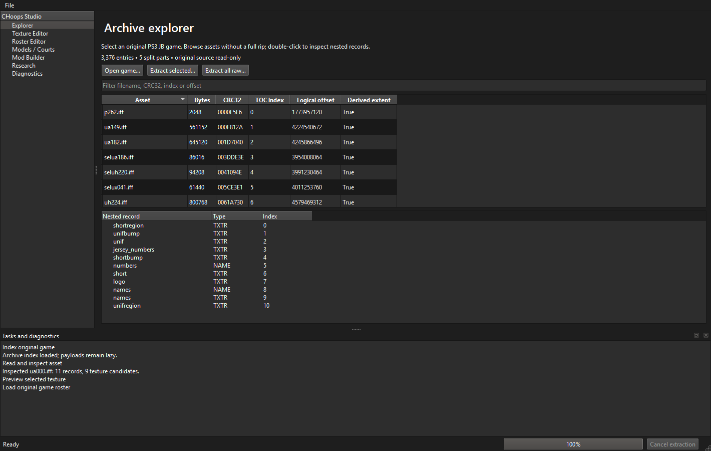

# CHoops Modding Studio — development rebuild

Native PySide6 desktop tools for PS3 College Hoops 2K8: lazy archive/nested-record browsing, raw extraction, DDS preview/export/import, confirmed roster fields, replacement-folder staging and separate JB builds. The source game remains read-only.

**The full v1.0beta mandate is not complete; no v1.0beta release/tag has been published.** Current evidence and remaining acceptance gaps: [feature matrix](docs/rebuild/FEATURE_MATRIX.md), [test report](docs/TEST_REPORT.md), [risks](docs/rebuild/RISKS.md).

```powershell
python -m venv .venv
.\.venv\Scripts\python.exe -m pip install -e ".[dev]"
.\.venv\Scripts\python.exe -m choops_py.studio
.\.venv\Scripts\python.exe -m choops_py.cli --help
```

Open the original JB/USRDIR in Explorer, double-click an asset, inspect/preview textures, save compatible edited copies, and stage them through Mod Builder. All generated output currently belongs under output/. No Node or HTTP server is required.

Local verification exercised read-only real inputs and separate generated outputs; environment-specific measurements are excluded from public documentation. Unknown formats stay read-only/unavailable, and runtime testing is NOT RUN.

The existing converter executables work locally, but their public redistribution grant has not been established. Packaging excludes them until resolved; [provenance](docs/rebuild/CONVERTER_PROVENANCE.md). The local prototype is a development build, not a released beta.

See [user guide](docs/USER_GUIDE.md), [development](docs/DEVELOPER_GUIDE.md), [format evidence](docs/FORMAT_SPECIFICATIONS.md), [performance](docs/PERFORMANCE.md), [architecture](docs/rebuild/ARCHITECTURE.md) and [acceptance gates](docs/rebuild/ACCEPTANCE_TESTS.md). Historical tags/docs remain preserved and must not be read as current proof.


